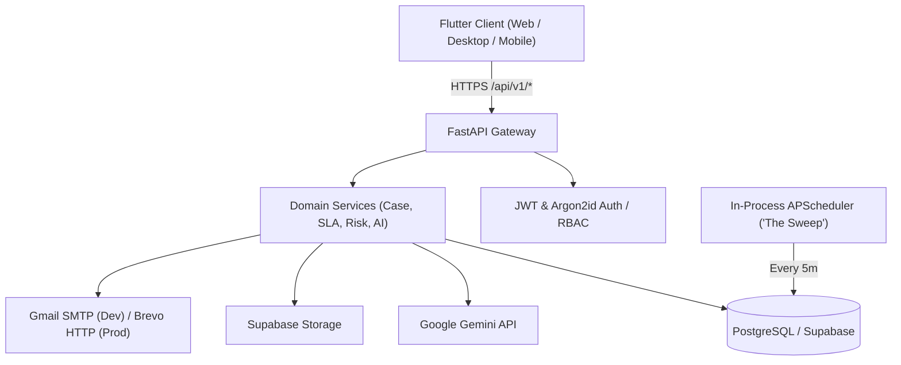

# 🛡️ AI IT Helpdesk — Intelligent Case Management & SLA System

An enterprise-grade, multi-platform IT Helpdesk and Case Lifecycle Management solution powered by **FastAPI**, **PostgreSQL (Supabase)**, **In-Process APScheduler ("The Sweep")**, **Google Gemini AI**, and a single **Flutter** codebase supporting Web, Desktop, and Mobile.

---

## 🚀 Key Features

- **⚡ Incident & Service Request Lifecycle**: Comprehensive state machine (`Ingested` ➔ `Assigned` ➔ `In Progress` ➔ `Waiting on Requester` ➔ `Resolved` ➔ `Closed` / `Reopened`) with **Optimistic Concurrency Versioning (`version` column)** to prevent lost updates.
- **🤖 Autonomous AI Copilot (Gemini API)**:
  - **Zero-touch Triage**: Category, Severity, and Priority classification with supporting factors and missing info chips.
  - **AI Communication Assistant**: Generates tailored response drafts (`info_request`, `progress_update`, `resolution`, `escalation_summary`).
  - **Smart Operator Assignment**: Recommends on-call operators by load, site, and domain skill.
  - **Semantic Duplicate Detection**: Identifies related or recurring incidents across the enterprise.
- **⏱️ 24/7 Elapsed Wall-Clock SLAs**: Continuous target tracking (P1: 15m/4h, P2: 1h/8h, P3: 4h/72h, P4: 24h/120h) evaluated every 5 minutes by the in-process background scheduler without worker queues.
- **📚 Knowledge Base & SOPs**: Authoring and instant resolution search for standard operating procedures.
- **📊 Manager Operational Telemetry**: Real-time KPI dashboard (MTTR, SLA Compliance, Backlog, Risk Breakdown), weekly Gemini narrative summaries, and CSV data exports.
- **📱 Responsive Flutter Multi-Platform App**: Adaptive navigation with desktop sidebars, tablet layouts, and mobile bottom navigation.

---

## 🛠️ Architecture & Tech Stack



| Layer | Technology |
|---|---|
| **Backend Framework** | FastAPI (Python 3.11+) with Uvicorn |
| **Database & ORM** | PostgreSQL, SQLAlchemy 2.0 (AsyncIO), Alembic |
| **AI Engine** | Google Gemini API via official `google-genai` SDK |
| **Background Tasks** | In-process APScheduler (No Redis/Celery dependency) |
| **Notifications** | Gmail SMTP (Local Dev) / Brevo HTTPS API (Staging & Production) |
| **Frontend Framework** | Flutter 3.x (Multi-platform: Web, macOS, Windows, Linux, Android, iOS) |
| **State & Navigation** | Provider + GoRouter |

---

## ⚡ Quick Start Guide

### Prerequisites
- Python 3.11+
- Flutter SDK (3.19+)
- PostgreSQL 15+ (or Docker)

### Option A: 1-Click Docker Setup (Backend + DB)

```bash
# 1. Start PostgreSQL and FastAPI in Docker
docker compose up --build -d

# 2. Seed realistic demo data
docker compose exec backend python -m backend.db.seed
```

### Option B: Local Development Setup

#### 1. Backend Setup
```bash
# Navigate to backend and create virtualenv
cd backend
python -m venv .venv
# On Windows: .venv\Scripts\activate
# On Linux/macOS: source .venv/bin/activate

# Install dependencies
pip install -r requirements.txt

# Configure environment variables
cp .env.example .env

# Run database migrations
alembic upgrade head

# Seed demo data
python -m backend.db.seed

# Start FastAPI server
uvicorn main:app --host 0.0.0.0 --port 8000 --reload
```

#### 2. Flutter Client Setup
```bash
cd client
flutter pub get

# Run on Chrome (Web)
flutter run -d chrome

# Or run as Native Desktop App
flutter run -d windows   # On Windows
flutter run -d macos     # On macOS
```

---

## 🔑 Demo Login Credentials

The demo database seeder automatically configures accounts for all 5 enterprise roles:

| Role | Email | Password | Site / Scope |
|---|---|---|---|
| 👑 **Administrator** | `admin@ithelpdesk.local` | `AdminPassword123!` | System-wide Admin & Audit Logs |
| 👔 **Operations Manager** | `manager@ithelpdesk.local` | `ManagerPassword123!` | Telemetry & Operational Insights |
| 🛠️ **Support Operator** | `operator.pune@ithelpdesk.local` | `OperatorPassword123!` | Pune Desk / Tier 1 Service Desk |
| 🛠️ **Support Operator** | `operator.blr@ithelpdesk.local` | `OperatorPassword123!` | Bengaluru / NOC Operations |
| 📚 **Knowledge Owner** | `knowledge.owner@ithelpdesk.local` | `KnowledgePassword123!` | SOP & Knowledge Base Authoring |
| 👤 **Requester** | `requester@ithelpdesk.local` | `RequesterPassword123!` | Self-Service Case Submission |

---

## 📂 Project Structure

```text
IT_HELPDESK/
├── backend/
│   ├── api/v1/                # REST Routes (Auth, Cases, AI, Knowledge, Reports, Admin)
│   ├── core/                  # Configuration, Security (Argon2id/JWT), Error Envelope
│   ├── db/                    # Session factory, Base models, Seed script
│   ├── models/                # SQLAlchemy ORM entities & Enums
│   ├── providers/             # Swappable Gemini, Storage, and Email providers
│   ├── scheduler/             # In-process APScheduler ("The Sweep")
│   ├── schemas/               # Pydantic request/response validation schemas
│   ├── services/              # Domain logic (SLA math, Case state machine, AI)
│   ├── tests/                 # Unit & Integration test suites
│   ├── Dockerfile
│   └── main.py                # FastAPI app & CORS configuration
├── client/
│   ├── lib/
│   │   ├── app/               # App entrypoint, Theme, GoRouter
│   │   ├── features/          # Auth, Cases, AI Copilot, Knowledge Base, Reports
│   │   └── shared/            # ApiClient, Models, Badges, Responsive Layout
│   └── pubspec.yaml
├── scripts/                   # Cross-platform startup & seed scripts (.bat / .sh)
├── docker-compose.yml
└── README.md
```

---

## 🧪 Testing

Run the automated test suite:

```bash
pytest backend/tests/
```

---

## 📜 License

Proprietary & Confidential. Built for Advanced Enterprise IT Operations.
